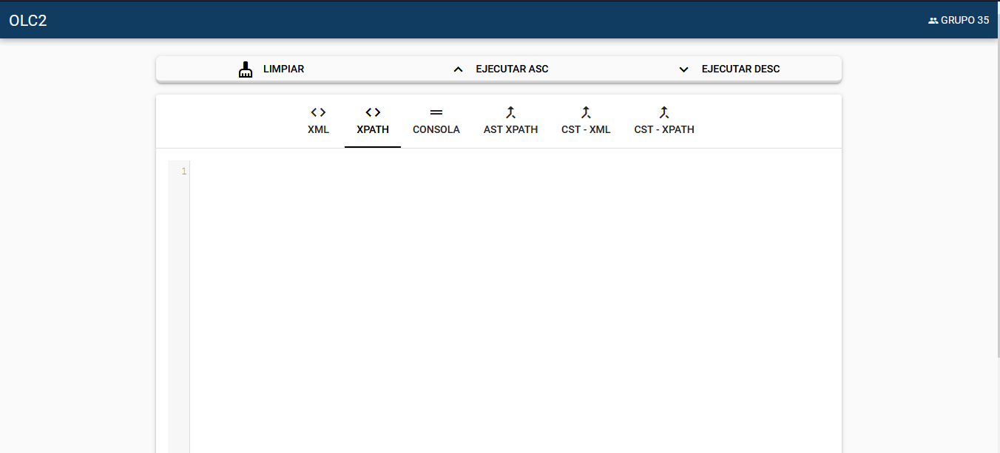
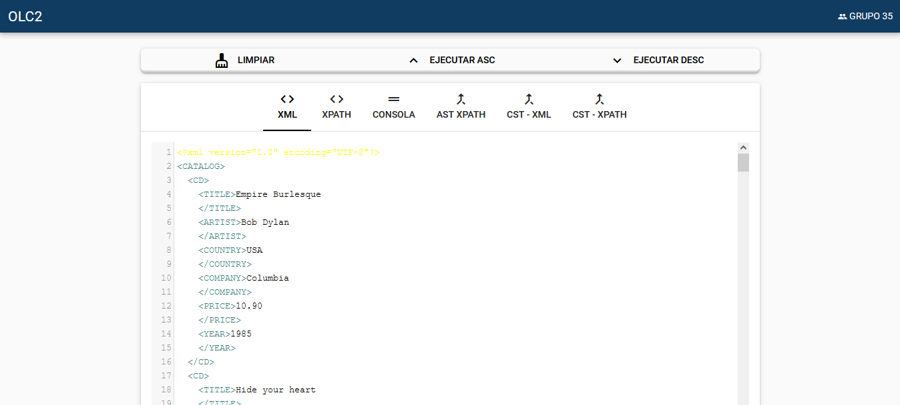
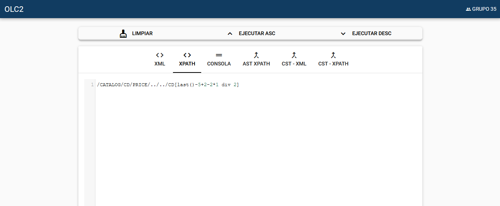
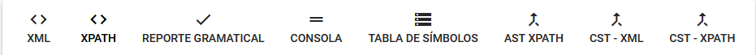

UNIVERSIDAD SAN CARLOS DE GUATEMALA

FACULTAD DE INGENIERÍA

ESCUELA DE CIENCIAS Y SISTEMAS

MANUAL DE USUARIO
==============

TYTUSX

ORGANIZACIÓN DE LENGUAJES Y COMPILADORES 2

GRUPO 35

Carnet

Nombre

201612419

Edvin Miguel Castro Ajaitas

201611269

Carlos Augusto Hernández Ordoñez

201612190

Marcos Sebastian Velasquez Cabrera

MANUAL DE USUARIO

Para poder hacer un uso correcto de la aplicación, se recomienda leer el presente manual.

INTERFAZ DE USUARIO
============

La aplicación cuenta con la siguiente interfaz de usuario para que el usuario interactue.

La interfaz cuenta con 3 botones principales y una barra de pestañas en donde el usuario puede observar los resultados.

Los botones principales son:
* Limpiar: Se encarga de limpiar los cuadros de texto para poder ingresar código nuevamente.

* Ejecutar: Analizará el analizador ascendente de la aplicación y  posteriormente ejecutará la aplicación de acuerdo a los parámetros enviados desde las pestañas de texto. Más adelante de explica esta función.

* Ejecutar desc: Analizará el analizador descendente de la aplicación y  posteriormente ejecutará la aplicación de acuerdo a los parámetros enviados desde las pestañas de texto. Más adelante de explica esta función.

Ingreso de datos
=====================

El usuario deberá ingresar los los datos en el formato correspondiente para poder realizar las consultas deseadas. Primero deberá ingresar los datos en el cuadro de texto de la pestaña XML en formato XML. 

Consultas
=====================

El usuario podrá ingresar querys para poder realizar consultas en la aplicación.

Barra de navegación
=====================

La aplicación cuenta con una barra de navegación en donde se visualizan distintos resultados de la ejecución.

* XML: Editor de texto para ingresar los datos en formato XML.

* XPATH: Editor de texto para ingresar los las consultas deseadas por el usuario.

* Reporte Gramtical: Muestra el reporte gramatical de las gramáticas utilizadas por el analizador XML y el analizador XPATH.
Se muestra una después de otra.

* Consola: Muestra la salida de la consulta realizada. Aquí se muestran los resultados.

* Tabla de símbolos: Permite observar la tabla de símboloes obtenida tras el análisis del XML. 

* AST XPATH: Muestra el reporte del AST de la entrada evaluada por el analizador XPATH.

* CST XML: Muestra el reporte del CST de la entrada evaluada por el analizador XML.

* CST XPATH: Muestra el reporte del CST de la entrada evaluada por el analizador PATH.